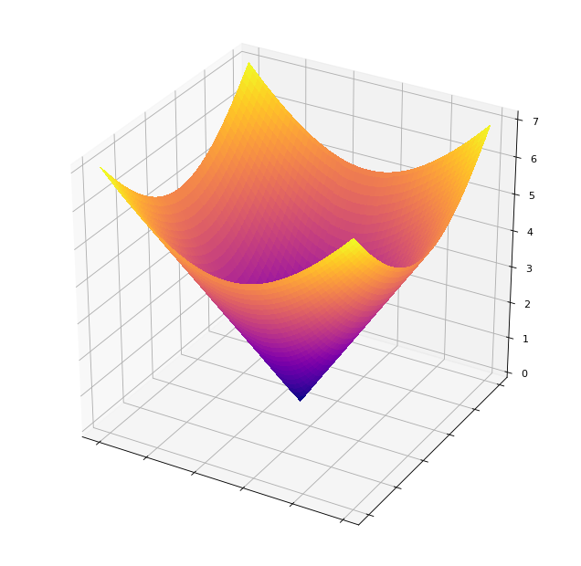
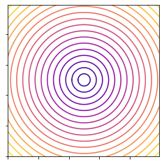
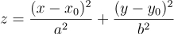
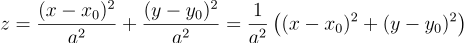
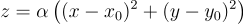
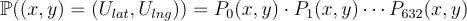
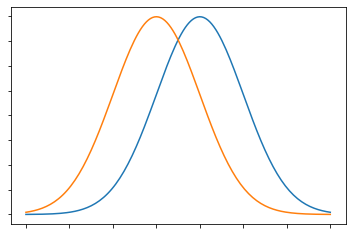
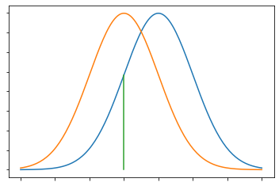
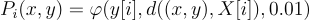

# Triangulating The Location of the Unicorn
In this portion of the assignment, we'll compute the latitude/longitude location of the unicorn.

## Starter Files
**Download the starter code (in a .zip file) [here](https://stanfordpython.com/res/starter-code/triangulate_startercode.zip)**.

1. `triangulate.py` is the main file that you'll be working with. In it, we'll do the math to extrapolate the unicorn's location.
 	- The `main` function is provided for you. It first calls `load_data('unicorndata.pickle')`, and then calls `clean_data(data)` on the return value from `load_data`. Then, it processes that data by calling `process_data` and prints out the return value (the latitude/longitude location of the unicorn).

## Triangulation

You should now have a bunch of noisy data about the unicorn's location in the form of a list of dicts:

```python
[
	{
		"latitude": ...,
		"longitude": ...,
		"distance": ...
	},
	...
]
```

Note by the way, that the *distance* is distance in *latitude/longitude* units. You don't need to know this, but: we're treating latitude and longitude as though they are coordinates for points in 2D space, and then we're computing the distance between two points in the normal way for 2D space. In reality, latitude and longitude describe a *curved space* (the surface of the Earth), so this way of computing distance is not really accurate. It's fine as long as we're on Stanford's campus, which is small compared to the entire globe, and so effectively behaves like 2D space. You can also notice this effect by the fact that, even though the Earth is curved, if you zoom into any point on the Earth's surface, it appears flat.

The list of dicts should be pickled (see the [documentation](https://docs.python.org/3/library/pickle.html)) and stored in a file called `unicorndata.pickle` (this filename will be used in subsequent steps).

### `load_data(filename)`
First, we need to load the data into the current namespace. To do this, we'll write `load_data(filename)`.

Using `pickle`, fill out the `load_data` function so that it opens the file referenced by `filename` and unpickles the data inside the file, and returns the information. If you run `$ python3 triangulate.py`, you should see something like:

```
(cs41-env)$ python3 triangulate.py
Press Enter to load the unicorn data...
Zeroeth data point: {'latitude': 37.421245948717946, 'longitude': -122.15347566666667, 'distance': 0.013740998028983013}

Press Enter to continue and clean the data...
Warning: no data cleaned. Is clean_data implemented?

Press Enter to continue and process the data...
The unicorn is at None, None.
```

### `clean_data(unicorn_data)`
Most of this assignment will be done in `numpy`, so we need to extract the data into a `numpy`-friendly format. *Note:* we've imported `numpy` as `np` in `triangulate.py`.

`clean_data` should reformat the list of dicts into two numpy arrays, `X` and `y`. `X` should be an `633 x 2` size array where each row corresponds to one data point and is of the form `[latitude, longitude]`. `y` should be an array of size `633` that is a list of distances. `X[i]` corresponds to `y[i]` (i.e., `y[i]` is the noisy distance that we observed from the point `X[i]`).

As a sanity check, here should be some (approximate) properties of your resulting arrays:

```python
np.sum(X, axis=0)  # => array([ 23693.1151959 , -77331.96931533])
np.sum(y)            # => 8.131987200337589
```

You can check those by running the file. At this point, your output should look something like:

```
(cs41-env)$ python triangulate.py
Press Enter to load the unicorn data...
Zeroeth data point: {'latitude': 37.421245948717946, 'longitude': -122.15347566666667, 'distance': 0.013740998028983013}

Press Enter to continue and clean the data...
Row 0: [  37.42124595 -122.15347567], with noisy distance: 0.013740998028983013
np.sum(X, axis=0) # => [ 23693.1151959  -77331.96931533]
np.sum(y) # => 8.131987200337589

Press Enter to continue and process the data...
The unicorn is at None, None.
```

### `process_data(X, y)`
There are two different ways we'll explain about how to process `X` and `y` to produce the latitude and longitude values we're looking for. You only need to implement one of these!

1. **The paraboloid method** is a more common approach to these problems in mathematics. The mathematics is a little bit simpler. This is the **default method**.
2. **The probability method** is a more common approach to these problems in computer science, especially in the AI courses. The mathematics is a much more tricky than the other method. This technique involves a knowledge of probability distributions.

If you'd prefer to use the probability method (or your own method), you should change the two line in `main` that reads:

```python
process_data = process_paraboloid_fit # change this to, e.g., process_prob_maximize
```

Once again, you **only need to write one function** to process the data. It can be either of the two methods we'll explain here, or your own. If you write your own, you'll need to attach another file to your submission explaining your algorithm (see the section on Submitting, at the bottom of this file).

#### `process_paraboloid_fit(X, y)`
Let's begin by discussing the mathematics behind this method. You can skip ahead to the "features matrix" section to implement it if you'd like. Imagine the function `f(x,y) = distance between (x,y) and the unicorn's location`. If we were to plot this function in 3D space as `(x, y, f(x,y))`, it would look like this:

<p align="center"></p>

The minimum point of the paraboloid would be the point where the unicorn is hidden. Additionally, the contour plot (horizontal slices) of the above plot is a series of concentric *circles*:

<p align="center"></p>

Now consider our data, in the form `(lat, lng, noisy_dist)`. If we were to plot that, it should look very much like that paraboloid. It won't *exactly* be a paraboloid, because the distance is noisy, so instead, we'll try to find the paraboloid that best approximates our data. This technique is called *fitting* a paraboloid to our data.

Once we do that, the minimum point of our paraboloid should be the location of our unicorn.

To fit a paraboloid to our data, we need to know the mathematical formula for a paraboloid. In this formula, `x, y, z` are the axis variables (it's a plot in `x-y-z` space) and the other variables are constants. In particular, `x_0, y_0` is the minimum point of the parabola, and `a, b` affect the shape of the parabola.

<p align="center"></p>

This is the *general* formula for a paraboloid, but since our paraboloid has circular cross-sections, that means that `a = b`. So, we can rewrite the formula as:

<p align="center"></p>

And, if we let `alpha = 1/a^2`, we can just write:

<p align="center"></p>

Since `x, y, z` are parameters used for plotting, this paraboloid is determined uniquely by three variables: `alpha, x_0, y_0`. We need to find those variables based on the observed data (`X` and `y`), and then the unicorn will be at `(x_0, y_0)`, which is the minimum point of the paraboloid (if you don't see why, think about it for a minute!).

If we expand the formula for `z`, we get the following:

<p align="center"></p>

Here, we've written the equation as a sum, where each term is of the form `(fitting variables) * (plotting parameters)`. For example, in the term `(-2 * alpha * x_0) * x`, the variables `alpha, x_0`, which appear in the left side of the product, are the fitting variables, and `x` is a plotting variable.

Another way to look at that equation, using the machine learning language, is that the terms `x^2 + y^2, x, y, 1` are the *features* and `alpha, -2*alpha*x_0, -2*alpha*y_0, alpha*x_0^2 + alpha*y_0^2` are the *weights*: 

<p align="center"></p>

We need to find the correct values for the weights so that the resulting function (which can be expressed as the dot product between the features vector and the weights vector) approximates the given data as best as possible. The technique we'll use for this is called [least-squares regression](https://en.wikipedia.org/wiki/Least_squares) (click on the link for extra information, but you don't need any of it).

To implement it, you need to first make a "features" matrix, where you convert `X` into a new matrix that is `633 x 4`, by mapping a row in `X`, which is of the form `[lat, lng]` into a row in the features matrix of the form `[(lat**2 + lng**2), lat, lng, 1]`.

Then, we need to extract the correct weights corresponding to the features. `numpy` has a built in function to do this, which you can read about [here](https://docs.scipy.org/doc/numpy/reference/generated/numpy.linalg.lstsq.html). The code to run it is simply:

```python
w_0, w_1, w_2, w_3 = np.linalg.lstsq(features, y, rcond=None)[0]
```

If you formatted the features matrix as above, we'll now have the following relationships between the weights and the earlier variables:

```python
w_0 == alpha
w_1 == -2 * alpha * x_0
w_2 == -2 * alpha * y_0
w_3 == alpha * (x_0 ** 2) + alpha * (y_0 ** 2) 
```

Thus, we can algebraically compute the value of `x_0` as:

```python
x_0 = (w_1 / w_0) * (-1/2)
```

Compute `y_0` yourself and return the pair `x_0, y_0`.

#### `process_prob_maximize(X, y)`
Another way to find the location of the unicorn is using the probability maximization technique. To use this technique, we write down a function `g(x, y)` that represents the *probability that the unicorn is at* `(x,y)`. Then, we use standard ML techniques (or in our case, third-party libraries) to find the coordinates `(x_0, y_0)` that maximize that probability.

The fundamental idea behind this function is that, if the unicorn is at `(U_lat, U_lng)`, then:

<p align="center"></p>

where:

<p align="center"></p>

In English, the probability that `(x, y)` is the location of the unicorn is equal to the product of the probabilities, for each `i`, that the `i`th point and its `noisy_dist` could have been generated if the unicorn was at `(x, y)`. 

For example, let's look at a situation where this probability is small. If the *actual* distance between `(x, y)` and `(lat, lng)` is small, but the `noisy_dist` that was in our data set is very large, then we can be fairly confident that `(x, y)` is not the location of the unicorn, because it isn't consistent with our data. We take the product of all such probabilities to account for all points in our data. (*Note*: we take a *product* because the probability events for each of the `P_i` are independent).

Now, our problem reduces to finding an expression for `P_i`. This is where we have to make some assumptions about how the noise was generated. Assume that the noisy distance was generated from a normal distribution, centered at the actual distance, with variance `0.01` (this assumption is reasonable, and data scientists often make very similar assumptions—talk to Parth if you're interested about why!).

Consider two normal distributions, then. The first normal distribution was used to *generate* the noisy data, so it's centered at the actual distance with variance `0.01`, and the second normal distribution has the *same variance*, but it's centered at the *value of the noisy data that was generated*. They might look something like this, with the first in blue and the second, to the left, in orange:

<p align="center"></p>

The value of `P_i`, then, is the value of the blue distribution at the max point of the orange distribution. (*Note*: once again, this is concealing some more complicated math. If you're interested, talk to Parth or take CS 109!). Let's draw that value on the graph:

<p align="center"></p>

Here's the cool part. That probability is *equal* to the value of the orange distribution at the max point of the *blue* distribution:

<p align="center"></p>

This lets us write out, explicitly, the value of `P_i`:

<p align="center"></p>

where `phi(x, mu, V)` is the value of the normal distribution centered at `mu`, with variance `V`, sampled at `x`. In Python, we can use the `scipy` library to get the value of the normal distribution:

```python
dist = numpy.linalg.norm(X[i] - pt)
P_i = scipy.stats.norm.pdf(y[i], dist, 0.01)
```

Now, we're mostly done, with one caveat: multiplying all of the `P_i`s together is not going to work because the values will be too small, so they won't be accurate enough on a computer. Instead, we can use the `np.log` function (natural logarithm) to change the calculation into addition. Recall the earlier formula:

<p align="center"></p>

If we take the negative natural log of both sides, since the log function is monotone increasing, the problem changes from *maximizing* the above function to *minimizing* the following function:

<p align="center"></p>

Note that taking the negative logarithm to simplify computation is a standard technique in optimization theory. In code:

```python
dist = numpy.linalg.norm(X[i] - pt) # pt == np.array([x, y])
P_i = scipy.stats.norm.pdf(y[i], dist, 0.01)
-np.log(P_i) # sum for every i
```

So, altogether, you should write a function `prob(pt)` that takes in a `numpy` array of the form `[x,y]` and computes a sum, for each row in `X`, of each of the values of `-np.log(P_i)`. Define this function *inside of `process_prob_maximize`* so that it also has access to `X` and `y`.

Now, we have to find a point `(x_0, y_0)` that minimizes `prob`. Luckily, there's a `scipy` tool for that. In `process_prob_maximize(X, y)`, after you define `prob`, you can just call 

```python
min_pt = scipy.optimize.minimize(prob, x0=(37.430334,-122.169814))
``` 

The value `x0` is the position to start testing at. I chose a point that's roughly in the center of Stanford, but you're free to choose another one! `scipy.optimize.minimize` returns a large object, but the minimum point it's found is the `x` attribute, i.e., `min_pt.x`. You should inspect the full output—it has information about whether the minimization succeeded; but even if it didn't, you should still return `min_pt.x`. (*Note*: when `scipy` says the minimization did not succeed, it just means that it couldn't find a minimum point within a reasonable amount of time. It's still probably found a point that's pretty close to the location of the unicorn.)

## Submitting
The only file you need to submit is `triangulate.py`. Not all functions need to be filled out: you only need to fill out functions that you used. Feel free to add additional helper functions in this file.

Additionally, if you developed your own technique to find the location of the unicorn, submit a file called `triangulation_desc` which contains a paragraph or two describing your algorithm (you can submit a text file or a word document or a PDF—whichever is easiest for you).