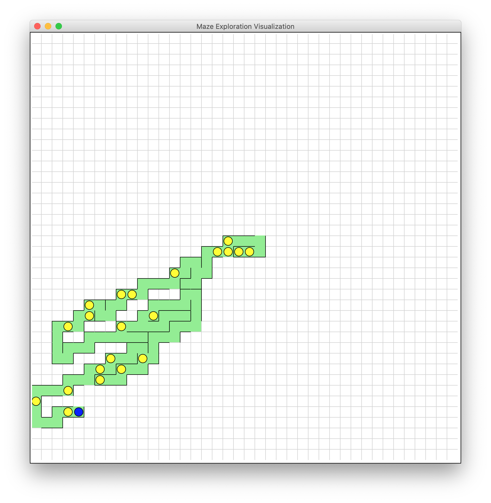

# Path (a): Requests / Graph Algorithms
For this option, you'll navigate a digital, online maze using Python.

## Starter Files

**Download the starter code (in a .zip file) [here](https://stanfordpython.com/res/starter-code/requests_startercode.zip)**.

We've provided the following starter files:

1. `exploremaze.py` is the primary file you'll modify for this phase, which will end by giving you some data you can use to determine the location of the unicorn.
2. `visualization.py` is a debugging helper that allows you to visualize the code in `exploremaze.py`. We *strongly* suggest you use this code (though it's not required). 
	- After you've implemented `exploremaze` (and during implementation), you should be able to use `visualization.py` to perform all the tasks in `exploremaze.py`. A screenshot:

	<p style="align: center;"></p>

	- After the program finishes executing, `visualization` will ask you if you want to save the data it collected, and will call your `save_data` function if you say yes.

3. `utils.py` contains some helpful utility functions that allow you to navigate the maze more easily.

## Navigating the Maze

To finish Phase 1, you'll have to navigate a digital, online maze that's hosted at [https://stanfordpython.com/maze/](https://stanfordpython.com/maze/). Unlike most mazes, you're not trying to get *out* of this maze. You're just trying to visit every point of the maze.

You start in the center of the 40 x 40 maze, and you can get information about the starting point by visiting [https://stanfordpython.com/maze/start.json](https://stanfordpython.com/maze/start.json). If you go to that URL, the result will be the following JSON file:

```json
{
	"neighbors": {
		"east": "fK2hTLljXcz4wuQlrOe5WUJHijQtPsFY1RTep3NNRr0oZ1kW1oZiofuoIUBJ.json",
		"west": "HhJgmdQkmaZAicYBCta0kImH5a9nb6QrCqHWwTgrKBBXAKX2RDV8ReyDnYLW.json"
	}
}
```

This means that from the start position, you can travel east or west. To "travel" east (or more precisely, to get information about the position that is one step to the east of the start position), you visit the JSON file referenced by the object. So, if you go to [https://stanfordpython.com/maze/fK2hTLljXcz4wuQlrOe5WUJHijQtPsFY1RTep3NNRr0oZ1kW1oZiofuoIUBJ.json](https://stanfordpython.com/maze/fK2hTLljXcz4wuQlrOe5WUJHijQtPsFY1RTep3NNRr0oZ1kW1oZiofuoIUBJ.json), the result will be:

```json
{
	"neighbors": {
		"north": "d1zFGddmZNWaD2lHWxH4asGY8OFfyGEvRcfVmf87QINCkFkV7oxasSUwjYSc.json",
		"west": "start.json"
	}
}
```

Note that the `"west"` key points back to `start.json` (moving east and then west will end up in the same place). Periodically, you'll hear the *cry of the unicorn*. At cells where you hear the unicorn cry, you'll get some additional information in the JSON file. It'll look something like:

```python
{
	"unicorn_cry": {
		"latitude": 37.420841,
		"longitude": -122.158036,
		"distance": 0.0172374
	},
	"neighbors": {
		...
	}
}
```

Notice that at these points, the return object has a `"unicorn_cry"` parameter. This parameter tells you about the latitude and longitude *of the point you're currently standing at* and it also tells you your distance away from the unicorn. The distance isn't precise: you can't hear the unicorn very well so it might be a little inaccurate.

During this part of the assignment, you'll **gather all of the unicorn data from the maze**.

### Gathering the Maze Data

You should write code to explore the digital maze using the `requests` library. You should do this in `exploremaze.py`, one of the files you'll submit. There are a few functions in this file:

1. `get_url_data(x, y, url)` should query the url, parse the JSON data at that point, and return a dict that represents the object. **You can do this in one line!**
2. `search_maze()` should use `get_url_data` to search through the entire maze and return a list of the data points where you hear the unicorn cry (that is, a list of dicts). 
3. `save_data(data, filename)` should save `data` into `filename` using the `pickle` library.
4. `main()` is written for you. It first calls `search_maze()` and then saves the data into a file called `unicorndata.pickle` (and overwrites that file if it already exists).

Some things to note:

- Once you've implemented `get_url_data` and `search_maze`, you can run `$ python3 visualization.py` in a terminal, which will open a visual maze and show how your code explores it.
  - *Related*: You might be wondering why `get_url_data` accepts `x` and `y` as parameters. That's purely for visualization purposes. You can take a look, but `visualization.py` overwrites `get_url_data` and uses the `x` and `y` parameters to visualize the data that your function will return.
- The maze is zero-indexed and measures 40 cells by 40 cells. You start at position (20, 20). Moving "east" is the same as moving right (i.e., incrementing `x` by one) and similarly for south, west, and north... You can call `utils.direction_conversion(direction, x, y)` to return the result of moving in `direction` from the point `(x,y)`.
- You can use whatever algorithm you'd like to use to search through the maze, as long as it visits every single cell in the maze.
  - If you're not sure how to do explore this maze, it might be helpful to read about [depth-first search](https://en.wikipedia.org/wiki/Depth-first_search). You can implement the depth-first search algorithm using a stack (both of which you should have learned about in CS 106B; those notes might help)! In Python, [you can use a list as a stack](https://docs.python.org/3.8/tutorial/datastructures.html#using-lists-as-stacks).
  - Feel free to come to office hours or email us if you're struggling with this, conceptually! This class is about Python, so we don't want to test you *too much* on non-Python related topics.
- `search_maze` should return a list of dicts. We're only interested in the cells where you hear a unicorn cry, so you should only add a dict to the list when that happens and you only need to retain the unicorn location data. The object you return should look something like:

```python
[
	{
		"latitude": 37.420841,
		"longitude": -122.158036,
		"distance": 0.0172374
	},
	...
]
```

- The whole process took about 4 minutes to fully run, on my computer (with a WiFi speed that's much less than the speed at Stanford, to be fair)
- Using `pickle` ([read about it here!](https://docs.python.org/3/library/pickle.html)), you should be able to implement `save_data` in two lines.
