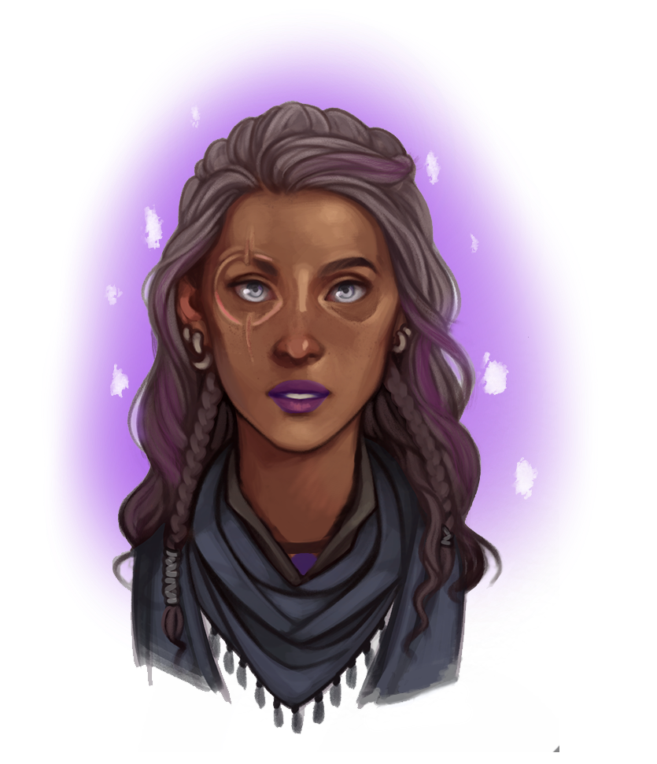

# CS41 Sample Project Proposal: D&D Character Generator

> Parth Sarin (psarin), Michael Cooper (coopermj), and Guido van Rossum (bdfl)

## Overview

We want to build a program that suggests (and generates) a Dungeons and Dragons character based on some information that you provide to it.

## Background

Dungeons and Dragons is a role-playing adventure game that Parth happens to play and love (his character is a unicorn-bloodline sorceress... go figure). Each player creates a character that they'll play as during the course of the game.

There are a lot of factors that go into character creation: you have to pick the correct stats for the character, the character needs a name and an alignment, etc. More often than not, players have a vision for their character that's designed around components of their personality, abilities, etc. rather than their stats.

There are a few websites on the internet that'll help you build your character, like [OrcPub](https://orcpub2.com/pages/dnd/5e/newb-character-builder), but all of them require you to specify what we'd consider extranneous information about your character, rather than focusing on the things that interest you the most.

We want to let a user supply a set of characteristics to include and exclude in their character - say, powers that they want their characters to have - and then we ask more questions that are needed, then build an entire character profile based on those characteristics. Hopefully, we can also use some machine learning techniques to generate new character profiles centered on the given specifications using a variant of k-nearest neighbors and a few hand-chosen heuristics.

## Implementation Strategy

Our project falls into three major categories - scraping the data, interacting with the user, and computing the character profile to output to the user.

First, we're going to scrape the [D&D 5e API](http://www.dnd5eapi.co/), which has all of the D&D information, collected from the Player's Handbook and Dungeon Master's Guide. We'll put all of the character, spell, and equipment information into a database so that we can efficiently query it later. For this part, we're going to rely extensively on the `requests` module discussed in class - and perhaps some of the multiprocessing primitives in the standard library to speed up the download.

To interact with the user, we're going to have a simple text-based I/O system where the user enters character information one at a time and then signals when done. We'll then ask more questions (but only the *really* important ones) and output a bunch of potential characters for the user to choose from.

To actually compute the best character profiles, we'll simply filter out all the characters that *don't* match the desired profile. Of the remaining options, we'll sort them on a combination of relevance to the original suggestions and based on self-computed heuristics about character effectiveness. We plan to use the awesome `pandas` library for better data manipulation of the character data in raw Python.

## Tasks

1. Authenticate to the D&D 5e API
2. Download all of the character, class, race, spell, and equipment information into a database
3. Load the data into Python classes: `Character`, `Class`, `Race`, `Equipment`, `Spell`
4. Main loop that asks user for characteristics and returns character objects using the class interface
5. Match character specifications to classes, races, equipment, and spells
6. Sort remaining characteristics by a "good" heuristic (we'll need to try a lot of heuristics)
7. *(Stretch)* Use common descriptional substitutions and word misspellings for more flexible user input
8. *(Stretch)* Map the characters into a high-dimensional vector space and run clustering algorithms to find the best-matching character profiles
9. *(Stretch)* Use generative adversarial networks to generate images of the character's face. Currently I had to draw this myself:

	

Honestly, the only part we're worried about is the actual algorithm of choosing the best matching character. Can a naive algorithm do "well enough," or do we need to incorporate ML techniques to get reasonable results? We're fairly confident that we can scrape the character data and do the console I/O.

### Estimated Timeline

**(Core)**

* Task 1 (1 hours) - both
* Task 2 (2 hours) - both
* Task 3 (0.5 hours) - Guido
* Task 4 (1 hours) - Michael
* Task 5 (1 hours) - Parth
* Task 6 (3 hours) - both

**(Stretch)**

* Task 7 (1.5 hours) - Michael
* Task 8 (4 hours) - Parth
* Task 9 (5 hours) - Guido

We've made a little progress on Task 1 (we acquired an API token), but we haven't used it to connect to the API endpoint yet.

## Resources

All of our data is going to come from the APIs described above, but we're also going to hand-code some test characters for small data sets to make sure the general logic is working. 
